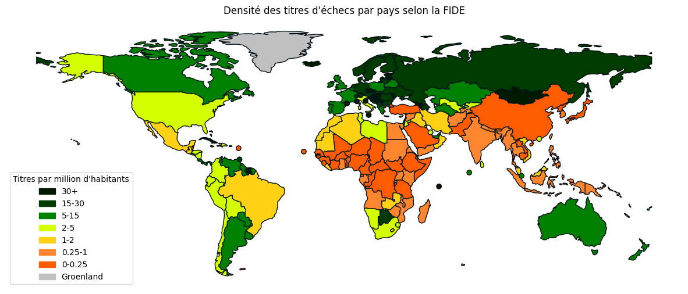

# Analyse et Visualisation des Titres d'Échecs par Habitant

## 📝 Vue d'ensemble du projet

Ce projet analyse la répartition des titres d'échecs par million d'habitants dans différents pays. L'objectif est de mettre en lumière les pays qui excellent dans la formation de joueurs d'échecs de haut niveau par rapport à leur taille de population.

## 📊 Fonctionnalités principales

- **Scraping de données** : Récupération automatique des dernières données sur les titres d'échecs depuis le site de la FIDE.
- **Données de population** : Intégration des données de population provenant de Wikipedia pour calculer les titres par million d'habitants.
- **Analyse géospatiale** : Visualisation des données sur une carte du monde, avec une codification par couleur des pays en fonction de leur densité de titres par habitant.
- **Gestion personnalisée** : Prise en charge des cas spéciaux, comme la fusion de territoires disputés ou de petits pays, pour une visualisation précise.

## 🚀 Pour commencer

### Prérequis

Pour exécuter le projet, vous aurez besoin de :

- Python 3.x
- Les bibliothèques Python suivantes :
  - `pandas`
  - `requests`
  - `beautifulsoup4`
  - `geopandas`
  - `matplotlib`
  - `shapely`

### Installation

1. Clonez ce dépôt sur votre machine locale :
   ```bash
   git clone https://github.com/votre_nom_utilisateur/Chess-Titles-Per-Capita.git

2. Installer les dépendances requises :
   ```bash
   pip install pandas requests beautifulsoup4 geopandas matplotlib shapely

3. Exécutez le script principal :
   ```bash
   python map_fide_population.py

## 🔍 Détails de l'analyse

Le script analyse les données des titres d'échecs en se basant sur les données de la FIDE et les données de population. Il génère une carte du monde où les pays sont colorés en fonction du nombre de titres d'échecs par million d'habitants. Les résultats mettent en évidence les pays avec une forte tradition échiquéenne par rapport à leur population.

## 📈 Résultats clés



*Figure 1 : Carte de nombre de titres d'échecs par million d'habitants*


Les pays avec une densité élevée de titres par habitant sont mis en évidence en vert foncé.
Les pays avec une faible densité de titres par habitant sont en rouge.
Le Groenland est coloré en gris pour indiquer l'absence de données.

## 🔗 Ressources

Données FIDE : https://ratings.fide.com/topfed.phtml?tops=0&ina=1&country=

Données de population sur Wikipedia : https://en.wikipedia.org/wiki/List_of_countries_and_dependencies_by_population

